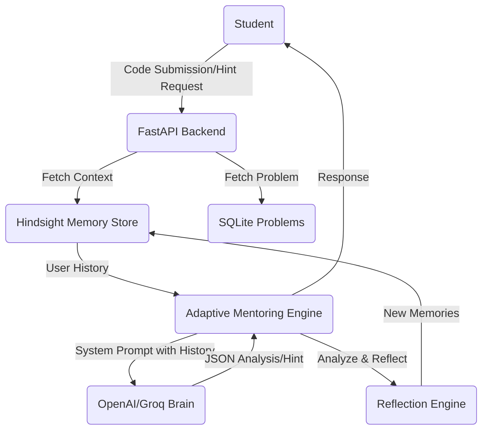

# RECALLCODE - Project Architecture

## High-Level Vision
RECALLCODE separates generic intelligence (LLM) from specific user memory (Hindsight). Every student interaction is filtered through their history.

## Key Components

### 1. Backend: FastAPI
-   **Structure**: Domain-driven modules (api, memory, mentoring, problems).
-   **Security**: Mock but extendable user identity tracking.
-   **Performance**: Fast, asynchronous endpoints for hint generation.

### 2. Hindsight Memory Store
-   **Schema**: Generic `MemoryEntry` that adapts to any pattern.
-   **Recall Logic**: Prioritizes higher "importance" memories and "recent" sessions.
-   **JSON Metadata**: Allows for structured data storage (e.g., failed test cases).

### 3. Mentoring & Reflection Engine
-   **Hint Level Adaptation**: Dynamic prompts that force the LLM to provide minimalist, history-aware guidance.
-   **Pattern Matching**: The Reflection Engine is tasked with finding *repeating* mistakes across sessions.

### 4. Frontend: Next.js + Tailwind
-   **UX First**: A "Mentor Panel" designed to make the AI's "brain" visible.
-   **Dashboard**: High-level statistics and behavioral insights.

## Scalability
-   **Multi-Language**: Architecture supports Python, JS, C++, and more.
-   **Persistence**: Easily swappable from SQLite to Postgres for larger deployments.
-   **LLM Flexibility**: Modular `LLMClient` allows switching providers instantly.
